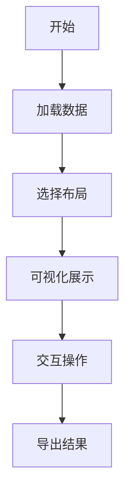

# Graph Visualization

欢迎使用 Graph Visualization 项目！这是一个用于可视化图数据的强大工具。

## 项目简介

Graph Visualization 是一个基于 Python 开发的图数据可视化工具，它提供了直观的界面和丰富的功能，帮助用户更好地理解和分析图数据。

### 主要特性

- 🎨 美观的图形界面
- 📊 多种可视化布局算法
- 🔍 交互式数据探索
- 📈 实时数据更新
- 🛠 丰富的自定义选项

## 快速开始

1. 安装项目
2. 运行程序
3. 导入数据
4. 开始可视化

## 文档导航

- [安装指南](installation.md) - 如何安装和配置项目
- [使用说明](usage.md) - 详细的使用教程
- [功能特性](features.md) - 项目的主要功能
- [常见问题](faq.md) - 常见问题解答
- [开发文档](development.md) - 开发者指南

## 示例展示

## 贡献指南

我们欢迎社区贡献！如果您有任何想法或改进建议，请随时提交 Issue 或 Pull Request。

## 许可证

本项目采用 MIT 许可证。详见 [LICENSE](LICENSE) 文件。 